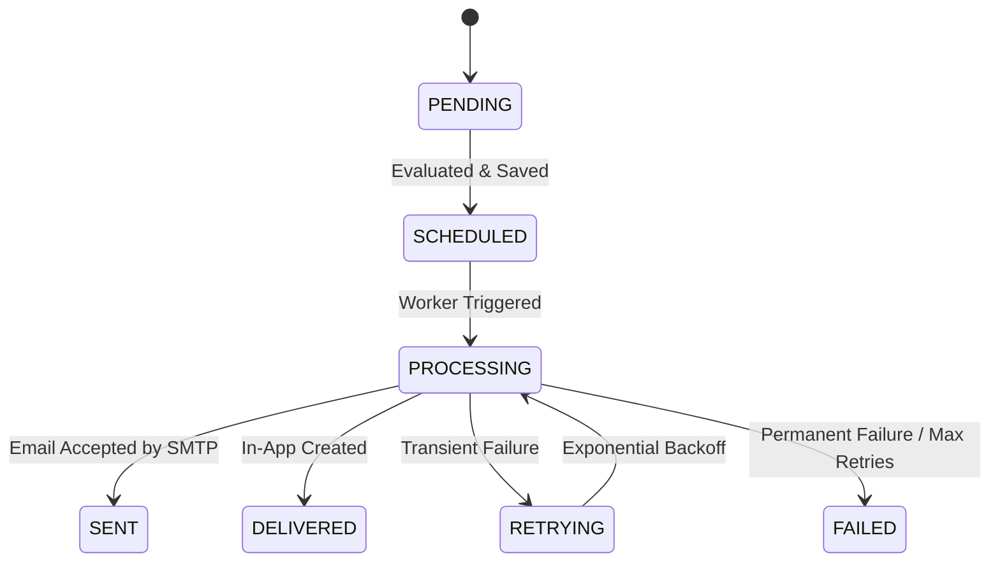
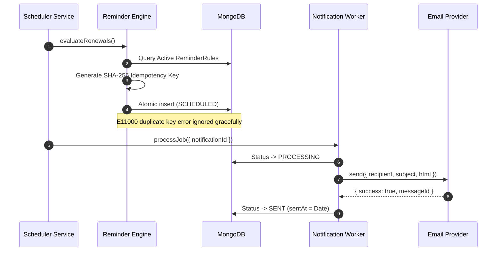
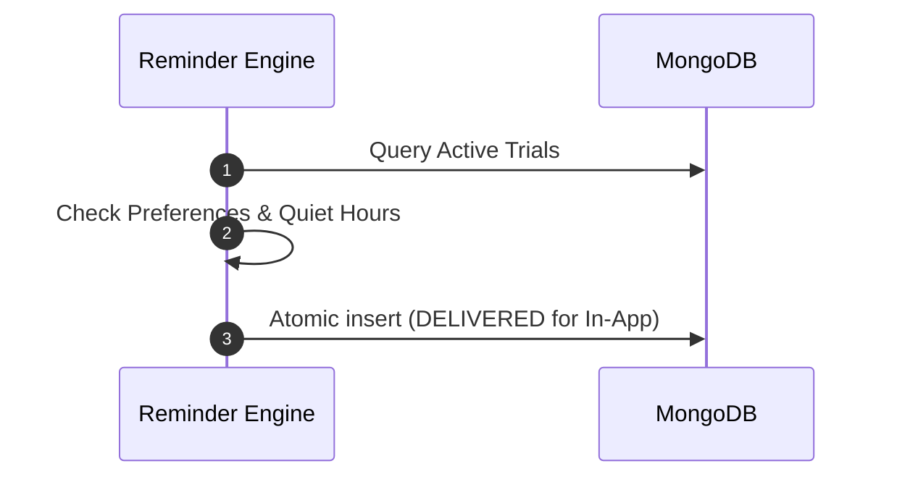
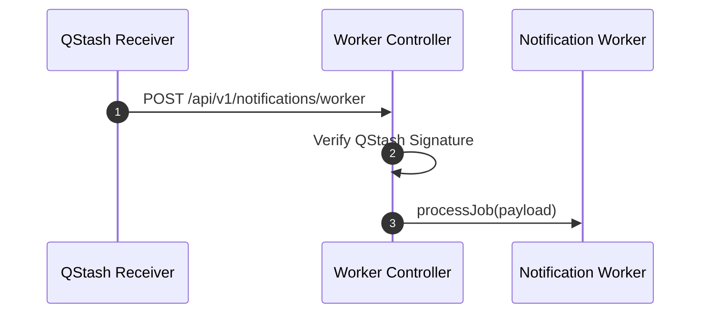
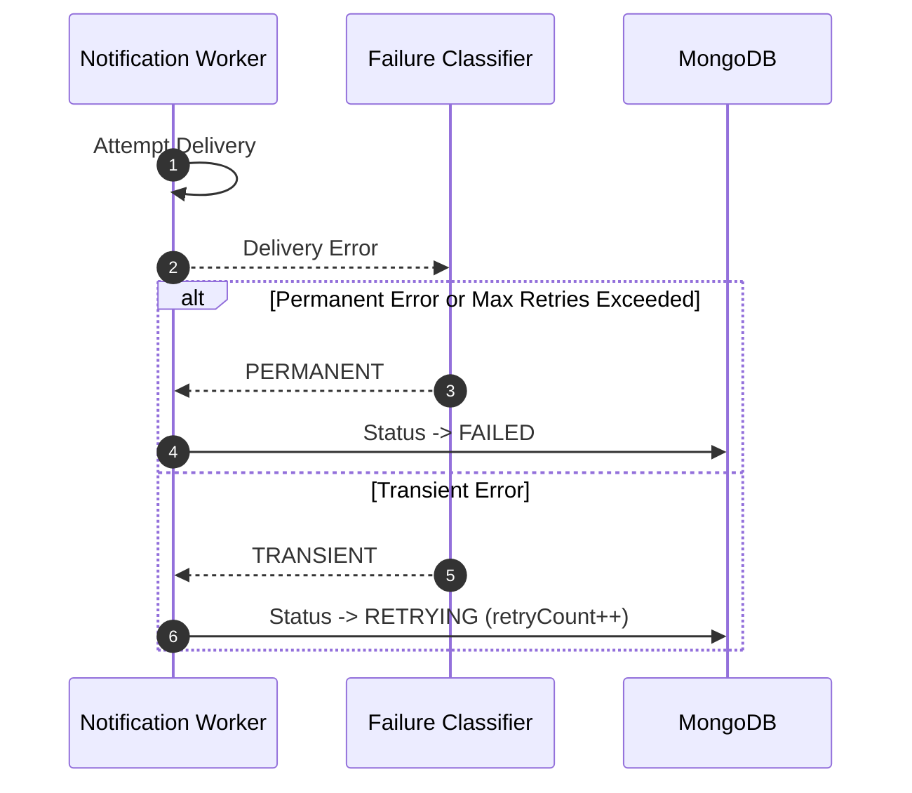

# Notification Architecture Guide — SubPulse

## Subsystem Boundary (`src/notifications/`)
SubPulse Notification & Reminder Platform operates as an asynchronous, idempotent, and retryable bounded subsystem isolated inside `src/notifications/`.

---

## 🧜‍♀️ Mermaid Architecture Diagrams

### 1. Notification Lifecycle State Diagram

### 2. Renewal Reminder Sequence Diagram

### 3. Trial Expiration Sequence Diagram

### 4. Async Worker Flow

### 5. Retry Flow

