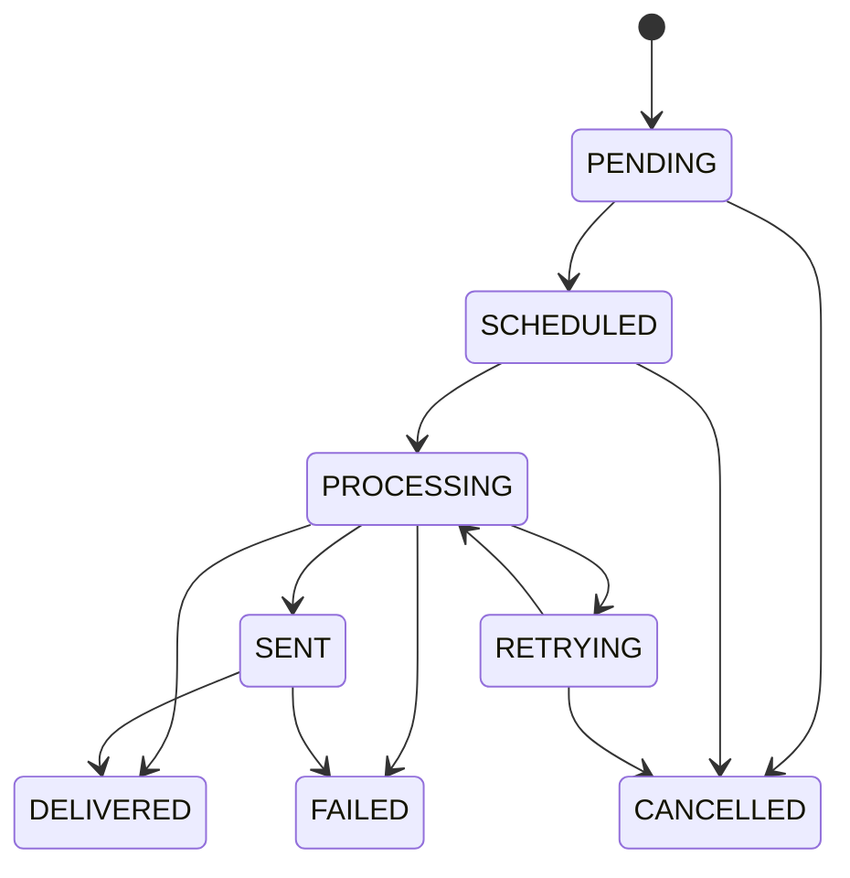

# Notification Reliability & State Machine

## Overview
This document describes the notification state machine and the reliability mechanisms implemented in SubPulse to ensure messages are delivered accurately and without dropping.

## State Machine
A notification goes through various states during its lifecycle. The 8 states are:
- `PENDING`: Created but not yet ready to be scheduled.
- `SCHEDULED`: Ready to be picked up by the processing worker at or after the scheduled time.
- `PROCESSING`: Currently being processed by a worker.
- `SENT`: Successfully handed off to the provider (e.g., SMTP server).
- `DELIVERED`: Confirmed delivered by the provider (if applicable).
- `RETRYING`: Temporarily failed and scheduled for another attempt.
- `FAILED`: Permanently failed (max retries reached or unrecoverable error).
- `CANCELLED`: Cancelled before processing.

### Legal State Transitions

## Delivery Semantics
SubPulse aims for **AT-LEAST-ONCE** delivery semantics. We do NOT guarantee exactly-once delivery.

### Atomic CAS (Compare-And-Swap)
We use an atomic `findOneAndUpdate` operation (CAS) to move a notification from `SCHEDULED` (or `RETRYING`) to `PROCESSING`. This ensures that **at-most-one** worker can actively process a notification at any given time.

### Why Not Exactly-Once?
If a worker successfully sends an email via SMTP but crashes immediately before updating the database status from `PROCESSING` to `SENT`, the notification will remain stuck in `PROCESSING`. The stale recovery job will eventually transition it back to `SCHEDULED`/`RETRYING`, leading to a re-delivery. 
Because Nodemailer/SMTP does not support provider-level idempotency keys natively in a way that prevents duplicates across reconnects on their end, exactly-once delivery cannot be guaranteed in the event of partial failures post-send.

## Idempotency and Duplicates
- **Idempotency Key:** Each notification requires an idempotency key (SHA-256 hash typically generated based on the trigger context, user, and entity).
- **Duplicate Prevention:** A MongoDB unique index on the `idempotencyKey` field prevents duplicate notifications from being created for the same event.
